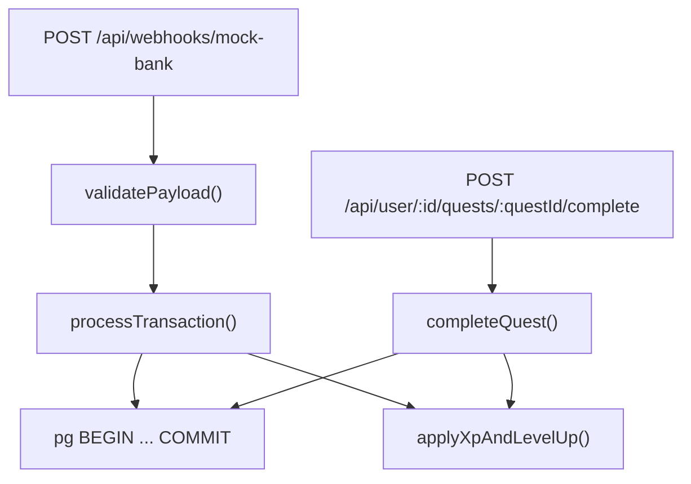

# Phase 2 — Game Logic Engine Technical Execution Plan

## Scope and constraints

- **In scope:** [`server/src/services/gameLogicEngine.ts`](server/src/services/gameLogicEngine.ts), webhook + quest routes, shared types, shared level-up helper, Vitest tests, `npm test` script.
- **Out of scope:** Frontend, migrations/schema changes, auth/session wiring beyond existing `requireAuth` + `SKIP_AUTH`.
- **Constants:** All XP/token thresholds from [`server/src/constants/gameConfig.ts`](server/src/constants/gameConfig.ts) only (already populated from PRD Section 4).
- **Current state:** Engine file is a placeholder comment; [`webhooks.ts`](server/src/routes/webhooks.ts) and [`quests.ts`](server/src/routes/quests.ts) return stubs; no `npm test` script exists in [`package.json`](package.json).

---

## Architecture overview



All multi-table writes share one `pg` client per request (`BEGIN` / `COMMIT` / `ROLLBACK`).

---

## Files to create or modify

| Action        | File                                                                                         | Purpose                                                                   |
| ------------- | -------------------------------------------------------------------------------------------- | ------------------------------------------------------------------------- |
| **Create**    | [`server/src/types/gameLogic.ts`](server/src/types/gameLogic.ts)                             | `BankWebhookPayload`, `GameEngineResult`, DB row shapes                   |
| **Modify**    | [`server/src/constants/gameConfig.ts`](server/src/constants/gameConfig.ts)                   | Add canonical quest `title` strings for quest matching (not in DB schema) |
| **Implement** | [`server/src/services/gameLogicEngine.ts`](server/src/services/gameLogicEngine.ts)           | Core engine + helpers                                                     |
| **Create**    | [`server/src/services/levelUp.ts`](server/src/services/levelUp.ts)                           | Shared XP → level → token logic                                           |
| **Modify**    | [`server/src/routes/webhooks.ts`](server/src/routes/webhooks.ts)                             | Real mock-bank handler                                                    |
| **Modify**    | [`server/src/routes/quests.ts`](server/src/routes/quests.ts)                                 | Real quest completion handler                                             |
| **Create**    | [`server/src/services/gameLogicEngine.test.ts`](server/src/services/gameLogicEngine.test.ts) | Unit tests per Phase 2 checklist                                          |
| **Modify**    | [`package.json`](package.json)                                                               | Add Vitest + `test` script                                                |
| **Modify**    | [`server/tsconfig.json`](server/tsconfig.json)                                               | Include test types if needed (`vitest/globals`)                           |

No other files touched (no `client/`, no migrations).

---

## Types (`server/src/types/gameLogic.ts`)

```typescript
export interface BankWebhookPayload {
  user_id: number;
  amount: number;
  merchant: string;
  system_category: "FIXED_BILL" | "DISCRETIONARY";
  timestamp: string;
}

export interface GameEngineResult {
  success: boolean;
  newState: "ACTIVE" | "GULAG" | "REDEMPTION";
  xpAwarded: number;
  leveledUp: boolean;
  tokenAwarded: "MICRO" | "STANDARD" | null;
  isViolation: boolean;
  toastMessages: string[];
}

export interface UserRow {
  id: number;
  playable_balance: string; // pg NUMERIC
  current_xp: number;
  level: number;
  wishlist_tokens_micro: number;
  wishlist_tokens_standard: number;
  state: "ACTIVE" | "GULAG" | "REDEMPTION";
}

export interface QuestRow {
  id: number;
  user_id: number;
  title: string;
  xp_reward: number;
  quest_type: "DAILY" | "WEEKLY" | "GULAG_REDEMPTION";
  status: "ACTIVE" | "COMPLETE" | "FAILED";
  streak_count: number;
}
```

---

## `gameConfig.ts` additions

Add display titles used when matching active quests (aligns with PRD Section 4.3 examples and Phase 3 UI):

```typescript
export const QUEST_TITLES = {
  ZERO_SPEND_DAY: "Zero Spend Day",
  UNDER_BUDGET_DAY: "Under Budget Day",
  GULAG_REDEMPTION: "Gulag Redemption",
} as const;
```

Gulag auto-generated quest uses `QUEST_XP_VALUES` entry `GULAG_REDEMPTION` for `xp_reward` (50) and `QUEST_TITLES.GULAG_REDEMPTION` for `title`.

---

## Core engine functions (`gameLogicEngine.ts`)

### Public API (required signature)

```typescript
export async function processTransaction(
  payload: BankWebhookPayload,
  userId: number,
): Promise<GameEngineResult>;
```

### Internal helpers (same file unless noted)

| Function                                                                               | Responsibility                                                                                                           |
| -------------------------------------------------------------------------------------- | ------------------------------------------------------------------------------------------------------------------------ |
| `validatePayload(raw: unknown): BankWebhookPayload`                                    | Throws `ValidationError` if shape invalid (used by route → 400)                                                          |
| `withTransaction<T>(fn: (client: PoolClient) => Promise<T>): Promise<T>`               | `pool.connect()`, `BEGIN`, `COMMIT` / `ROLLBACK`, release client                                                         |
| `fetchUserForUpdate(client, userId): Promise<UserRow>`                                 | `SELECT ... FOR UPDATE`; throw if missing                                                                                |
| `fetchActiveQuests(client, userId): Promise<QuestRow[]>`                               | Active quests only                                                                                                       |
| `getTodaysDiscretionaryTotal(client, userId, day): Promise<number>`                    | Sum today's `DISCRETIONARY` rows from `transactions`                                                                     |
| `getDailyDiscretionaryLimit(playableBalance: number, refDate: Date): number`           | `playableBalance / daysRemainingInMonth` (PRD “daily discretionary limit” — no DB column; derived from playable balance) |
| `isViolationOfActiveQuests(quests, category, amount, todayTotal, dailyLimit): boolean` | See rules below                                                                                                          |
| `buildInitialResult(user): GameEngineResult`                                           | Zeroed result with `newState` from user                                                                                  |

### Violation rules (PRD Section 9: “violation of active quests”)

Only evaluated when `system_category === 'DISCRETIONARY'` and `user.state === 'ACTIVE'`:

1. **Zero Spend Day** — active `DAILY` quest with `title === QUEST_TITLES.ZERO_SPEND_DAY` → any discretionary spend is a violation.
2. **Under Budget Day** — active `DAILY` quest with `title === QUEST_TITLES.UNDER_BUDGET_DAY` → violation if `(todayDiscretionaryTotal + amount) > dailyLimit`.
3. If no active quest matches either rule → **not** a violation (“valid spend” path for tests).

`FIXED_BILL` never triggers quest violation logic.

### `processTransaction` processing flow (exact PRD Section 9 order)

Within a single DB transaction:

1. **Validate** `userId` matches `payload.user_id` (or reject — prevents cross-user writes).
2. **Lock user** + load active quests.
3. **Branch: `FIXED_BILL`**
   - Deduct `playable_balance` by `amount`.
   - `INSERT` transaction (`is_violation = false`).
   - Return early (`xpAwarded = 0`, state unchanged).

4. **Branch: `user.state === 'GULAG'`** (discretionary only reaches here)
   - Deduct balance.
   - `INSERT` transaction (`is_violation = true`).
   - Return early (no XP, no level-up, state stays `GULAG`).

5. **Branch: `user.state === 'REDEMPTION'`** (PRD Section 5: XP frozen)
   - Deduct balance.
   - `INSERT` transaction (`is_violation = false` unless discretionary spend should break streak — **Phase 2 exit criteria do not test REDEMPTION**; keep state `REDEMPTION`, no XP).
   - Return early.

6. **Branch: `ACTIVE` + discretionary**
   - Compute `isViolation` via `isViolationOfActiveQuests`.
   - **If violation (`YES`):**
     - Deduct balance.
     - `UPDATE users SET state = 'GULAG'` (XP/level unchanged per PRD Section 5).
     - `INSERT` `GULAG_REDEMPTION` quest (`streak_count = 0`, `status = 'ACTIVE'`, `xp_reward` from `gameConfig`).
     - `INSERT` transaction (`is_violation = true`).
     - Push toast: `Violation detected. Battle Pass frozen.`
     - **Do not** call level-up helper.
   - **If not violation (`NO`):**
     - Deduct balance.
     - `INSERT` transaction (`is_violation = false`).
     - If **Under Budget Day** quest active and spend is within limit → award `xp_reward` (15 from config), mark that quest `COMPLETE`, push quest toast: `+15 XP. Under Budget Day complete.` (PRD Section 10 pattern: `+{n} XP. {title} complete.`).
     - Call **`applyXpAndLevelUp`** (shared helper) when `xpAwarded > 0`.

7. **Return** `GameEngineResult` with final `newState`, aggregates, and `toastMessages`.

> **Note on `REDEMPTION`:** PRD state diagram shows `GULAG → REDEMPTION` on quest generation, but Phase 2 exit criteria explicitly require `users.state = 'GULAG'` after a violation webhook. **Persist `GULAG`** after violation; defer `REDEMPTION` transition to a later phase unless you direct otherwise.

---

## Shared level-up module (`levelUp.ts`)

```typescript
export interface LevelUpOutcome {
  newXp: number;
  newLevel: number;
  leveledUp: boolean;
  tokenAwarded: "MICRO" | "STANDARD" | null;
  toastMessages: string[];
}

export async function applyXpAndLevelUp(
  client: PoolClient,
  user: UserRow,
  xpToAdd: number,
): Promise<LevelUpOutcome>;
```

**Logic (no magic numbers):**

- `newXp = user.current_xp + xpToAdd` (cap at `SEASON_MAX_XP` / 2700 from config).
- Walk `XP_LEVEL_THRESHOLDS` to find highest level where `newXp >= xpRequiredCumulative`.
- If `newLevel > user.level`:
  - Set `leveledUp = true`.
  - Read `tokenReward` from the **reached** level config entry.
  - Increment `wishlist_tokens_micro` or `wishlist_tokens_standard` when `tokenReward` is `MICRO` / `STANDARD`.
  - Toasts (PRD Section 10 exact strings):
    - `LEVEL UP. You are now Level {n}.`
    - If Micro: `Micro-Token earned. Check your Vault.`
    - Level 10 Standard token: PRD lists only Micro token toast — emit **level-up toast only** for Level 10 (no invented Standard-token toast string).
- **Single UPDATE** on `users` for `current_xp`, `level`, and token columns.

Used by both `processTransaction` (ACTIVE, non-violation path) and quest completion route.

---

## SQL queries (all parameterized)

### Shared reads (start of transaction)

```sql
-- Lock user row
SELECT id, playable_balance, current_xp, level,
       wishlist_tokens_micro, wishlist_tokens_standard, state
FROM users
WHERE id = $1
FOR UPDATE;

-- Active quests
SELECT id, user_id, title, xp_reward, quest_type, status, streak_count
FROM quests
WHERE user_id = $1 AND status = 'ACTIVE';

-- Today's discretionary spend (for Under Budget check)
SELECT COALESCE(SUM(amount), 0) AS total
FROM transactions
WHERE user_id = $1
  AND system_category = 'DISCRETIONARY'
  AND processed_at::date = CURRENT_DATE;
```

### Balance + transaction log (every path that processes a payment)

```sql
UPDATE users
SET playable_balance = playable_balance - $2
WHERE id = $1;

INSERT INTO transactions (user_id, amount, merchant, system_category, is_violation)
VALUES ($1, $2, $3, $4, $5)
RETURNING id;
```

### Violation → Gulag

```sql
UPDATE users SET state = 'GULAG' WHERE id = $1;

INSERT INTO quests (user_id, title, xp_reward, quest_type, status, streak_count)
VALUES ($1, $2, $3, 'GULAG_REDEMPTION', 'ACTIVE', 0);
```

### Non-violation quest completion (Under Budget on webhook)

```sql
UPDATE quests SET status = 'COMPLETE' WHERE id = $1 AND user_id = $2;
```

### Level-up (via `applyXpAndLevelUp`)

```sql
UPDATE users
SET current_xp = $2,
    level = $3,
    wishlist_tokens_micro = $4,
    wishlist_tokens_standard = $5
WHERE id = $1;
```

### Quest completion route (`quests.ts`)

```sql
SELECT id, user_id, title, xp_reward, quest_type, status
FROM quests
WHERE id = $1 AND user_id = $2
FOR UPDATE;

-- Reject in application if quest_type = 'GULAG_REDEMPTION' → 403

UPDATE quests SET status = 'COMPLETE' WHERE id = $1;

-- Then applyXpAndLevelUp with quest.xp_reward
-- Quest toast: "+{xp_reward} XP. {title} complete."
```

---

## Route wiring

### [`server/src/routes/webhooks.ts`](server/src/routes/webhooks.ts)

- Parse `req.body`, call `validatePayload`.
- `userId = payload.user_id`.
- `const result = await processTransaction(payload, userId)`.
- `200` + JSON `GameEngineResult`.
- `400` on validation error `{ error: message }`.
- `500` on unexpected DB/engine errors.

### [`server/src/routes/quests.ts`](server/src/routes/quests.ts)

- Parse `:id`, `:questId`; verify numeric.
- Run quest completion in `withTransaction`.
- `403` if `quest_type === 'GULAG_REDEMPTION'`.
- `404` if quest not found / wrong user.
- `200` with `{ current_xp, level, toastMessages, leveledUp, tokenAwarded }`.

---

## Unit tests (`gameLogicEngine.test.ts`)

**Runner:** Vitest (add to root `package.json`: `"test": "vitest run"`).

**Strategy:** Mock `pool.connect()` / `PoolClient.query` to assert SQL call order and simulate failure; no real DB required for CI.

| Test case                         | Setup                                              | Assertions                                                                       |
| --------------------------------- | -------------------------------------------------- | -------------------------------------------------------------------------------- |
| ACTIVE + valid Under Budget spend | User ACTIVE, Under Budget quest, spend under limit | `state` stays ACTIVE, `xpAwarded > 0`, transaction `is_violation = false`        |
| ACTIVE + Zero Spend violation     | User ACTIVE, Zero Spend quest, DISCRETIONARY       | `state = GULAG`, `GULAG_REDEMPTION` quest inserted, `is_violation = true`, no XP |
| GULAG + discretionary             | User GULAG                                         | State unchanged, no XP/level update, `is_violation = true`                       |
| GULAG + FIXED_BILL                | User GULAG                                         | Balance deducted, state unchanged, `is_violation = false`                        |
| Level 5 threshold                 | User at 695 XP + 25 XP award                       | Level 5, `wishlist_tokens_micro` +1, Micro token toast                           |
| Level 10 threshold                | User at 2695 XP + 25 XP                            | Level 10, `wishlist_tokens_standard` +1                                          |
| DB failure mid-write              | Mock `query` throw on 3rd call                     | `ROLLBACK` issued, rethrow; follow-up read shows unchanged state                 |

Also test `validatePayload` rejects missing/invalid fields.

---

## Manual exit-criteria verification (Postman)

After implementation, verify with `SKIP_AUTH=true`:

1. `POST /api/webhooks/mock-bank` — DISCRETIONARY + Zero Spend quest → `users.state = GULAG`, transaction row, redemption quest row.
2. FIXED_BILL → balance ↓, transaction row, no state/XP change.
3. Second webhook in GULAG → no XP/level change.
4. Under-budget discretionary → XP/transaction updated.
5. Level-up at thresholds → correct token columns.

---

## Dependency addition

Add **Vitest** (+ `@types/node` already present) as devDependency at repo root. No other new runtime deps.

---

## PRD alignment notes (no clarifying questions)

- **Violation vs valid spend** is derived from active quest titles + Under Budget daily limit formula above (schema has no `daily_limit` column).
- **GULAG does not reset XP/level** — violation path only updates `state` + inserts quest.
- **Toast strings** use PRD Section 10 templates exactly; dynamic segments use actual quest title / level number.
- **GULAG_REDEMPTION** manual completion blocked in quest route only (per Phase 2 prompt).
