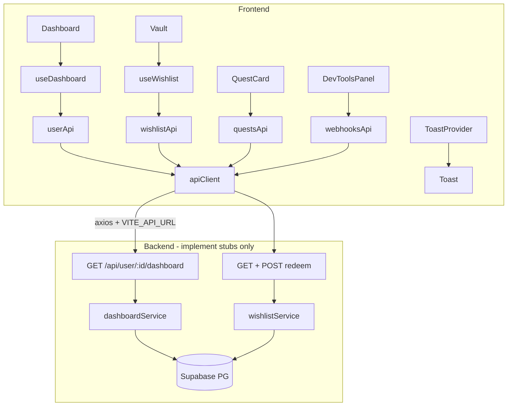

# Phase 4 — Wire Up Execution Plan

## Current state

| Area                     | Status                                                                                                                                                            |
| ------------------------ | ----------------------------------------------------------------------------------------------------------------------------------------------------------------- |
| Phase 3 UI               | Complete — [`Dashboard.tsx`](client/src/pages/Dashboard.tsx), [`Vault.tsx`](client/src/pages/Vault.tsx), all components render with hardcoded data                |
| Backend game loop        | Live — [`webhooks.ts`](server/src/routes/webhooks.ts), [`quests.ts`](server/src/routes/quests.ts), [`gameLogicEngine.ts`](server/src/services/gameLogicEngine.ts) |
| Backend read/write stubs | Still return `{ status: "stub" }` from [`user.ts`](server/src/routes/user.ts) and [`wishlist.ts`](server/src/routes/wishlist.ts)                                  |
| Frontend API layer       | Does not exist; [`useDashboard.ts`](client/src/hooks/useDashboard.ts) is a stub                                                                                   |
| `axios`                  | Not installed in [`client/package.json`](client/package.json)                                                                                                     |

**Constraint recap:** Do not modify [`gameLogicEngine.ts`](server/src/services/gameLogicEngine.ts), [`levelUp.ts`](server/src/services/levelUp.ts), [`webhooks.ts`](server/src/routes/webhooks.ts), or [`quests.ts`](server/src/routes/quests.ts). No DB migrations. No new pages. `Toast.tsx` is explicitly required by Phase 4 (exception to "no new UI").

---

## Architecture overview



---

## Part A — Backend (implement stubs first)

Business logic goes in **services**, not route handlers (per project rules). Routes parse params, call services, map errors to HTTP status codes.

### A1. Create [`server/src/services/dashboardService.ts`](server/src/services/dashboardService.ts)

**Function:** `getDashboard(userId: number)`

- Query `users` for: `username`, `level`, `current_xp`, `playable_balance`, `state`, `wishlist_tokens_micro`, `wishlist_tokens_standard`
- Query `quests` where `user_id = $1 AND status = 'ACTIVE'` (includes `GULAG_REDEMPTION` quests per Phase 7 prompt)
- Compute `xp_to_next_level` using [`XP_LEVEL_THRESHOLDS`](server/src/constants/gameConfig.ts):
  - If user is below max level → cumulative XP of **next** level threshold
  - If at level 10 → `SEASON_MAX_XP` (2700)
- Return shape:

```typescript
{
  user: {
    username: string;
    level: number;
    current_xp: number;
    xp_to_next_level: number;
    playable_balance: number; // parse NUMERIC to number
    state: "ACTIVE" | "GULAG" | "REDEMPTION";
    wishlist_tokens_micro: number;
    wishlist_tokens_standard: number;
  }
  quests: Array<{
    id: number;
    title: string;
    xp_reward: number;
    quest_type: "DAILY" | "WEEKLY" | "GULAG_REDEMPTION";
    status: "ACTIVE";
    streak_count: number;
  }>;
}
```

- Errors: throw typed errors or return null → route maps to `404` if user not found

### A2. Replace stub in [`server/src/routes/user.ts`](server/src/routes/user.ts)

- Remove `sendStub` usage
- `GET /:id/dashboard` → parse `id`, call `getDashboard`, return JSON
- Status codes: `400` invalid id, `404` user not found, `500` on unexpected error

### A3. Create [`server/src/services/wishlistService.ts`](server/src/services/wishlistService.ts)

**Function:** `getWishlist(userId: number)`

- Join user token counts + all wishlist rows for user
- Return `{ items: [...], wishlist_tokens_micro, wishlist_tokens_standard }`
- Map DB rows: `price_zar` NUMERIC → number

**Function:** `validateRedeem(userId, itemId)` — Step 1 (no writes)

- `SELECT ... FOR UPDATE` on user + item inside transaction, then `ROLLBACK` (read-only validation) OR query without mutation
- Checks: item exists, belongs to user, `is_purchased = false`, sufficient tokens for `token_type`/`token_cost`
- Success: `{ success: true, item }`
- Failure reasons → `400` with `{ error: "..." }` (e.g. "Not enough Micro-Tokens.")

**Function:** `confirmRedeem(userId, itemId)` — Step 2 (writes)

- Single `BEGIN`/`COMMIT` transaction:
  1. Lock user + item (`FOR UPDATE`)
  2. Re-validate (prevents bypassing step 1 per Phase 6 criteria)
  3. Deduct tokens from correct column
  4. Set `is_purchased = true`
- Return `{ success: true, toastMessages: ["Unlocked: {item_name}. Go get it."], wishlist_tokens_micro, wishlist_tokens_standard }`

### A4. Replace stubs in [`server/src/routes/wishlist.ts`](server/src/routes/wishlist.ts)

- `GET /:id/wishlist` → `getWishlist`
- `POST /:id/wishlist/:itemId/redeem` → `validateRedeem`
- `POST /:id/wishlist/:itemId/confirm-redeem` → `confirmRedeem`
- Map errors: `400` validation, `404` not found, `500` server error

### A5. Enable cross-origin dev requests

Frontend (Vite ~5173) calling backend (3000) with `withCredentials: true` requires CORS.

- Add `cors` dependency to root [`package.json`](package.json)
- In [`server/src/index.ts`](server/src/index.ts), add `cors({ origin: "http://localhost:5173", credentials: true })` **before** routes
- Keep `SKIP_AUTH=true` in [`server/.env`](server/.env) during this phase

**Do not touch:** webhooks, quests, gameLogicEngine, levelUp, migrations.

---

## Part B — Frontend API layer

### B1. Install dependencies and env

- `npm install axios` in `client/`
- Create [`client/.env.example`](client/.env.example): `VITE_API_URL=http://localhost:3000`
- Document that dev needs `client/.env` with same value (gitignored)

### B2. Create [`client/src/constants/userId.ts`](client/src/constants/userId.ts)

```typescript
// TODO: replace with session user ID after Phase 5
export const HARDCODED_USER_ID = 1;
```

### B3. Create [`client/src/api/client.ts`](client/src/api/client.ts)

- `axios.create({ baseURL: import.meta.env.VITE_API_URL, withCredentials: true })`
- Typed error helper extracting `error.response?.data.error` string

### B4. Create [`client/src/api/types.ts`](client/src/api/types.ts)

Strict interfaces (no `any`):

| Type                     | Purpose                                                                  |
| ------------------------ | ------------------------------------------------------------------------ |
| `DashboardResponse`      | Matches A1 return shape                                                  |
| `WishlistResponse`       | Items + token counts                                                     |
| `RedeemValidateResponse` | Step 1 success                                                           |
| `ConfirmRedeemResponse`  | Step 2 success with `toastMessages`                                      |
| `QuestCompleteResponse`  | Matches existing [`quests.ts`](server/src/routes/quests.ts) response     |
| `GameEngineResult`       | Matches [`server/src/types/gameLogic.ts`](server/src/types/gameLogic.ts) |
| `BankWebhookPayload`     | PRD Section 8.3                                                          |
| `ApiErrorResponse`       | `{ error: string }`                                                      |

Keep UI domain types in [`client/src/types/index.ts`](client/src/types/index.ts); map API → UI types in hooks/API functions where field names align.

### B5. Create resource API modules

| File                                                       | Functions                                                        |
| ---------------------------------------------------------- | ---------------------------------------------------------------- |
| [`client/src/api/user.ts`](client/src/api/user.ts)         | `fetchDashboard(userId)` → `DashboardResponse`                   |
| [`client/src/api/wishlist.ts`](client/src/api/wishlist.ts) | `fetchWishlist`, `redeemItem` (step 1), `confirmRedeem` (step 2) |
| [`client/src/api/quests.ts`](client/src/api/quests.ts)     | `completeQuest(userId, questId)` → `QuestCompleteResponse`       |
| [`client/src/api/webhooks.ts`](client/src/api/webhooks.ts) | `fireMockBankWebhook(payload)` → `GameEngineResult`              |

All functions use `HARDCODED_USER_ID` internally or accept `userId` param defaulting to constant.

---

## Part C — Toast system

### C1. Create [`client/src/context/ToastContext.tsx`](client/src/context/ToastContext.tsx)

- `ToastProvider` + `useToast()` hook
- `showToasts(messages: string[])` — pushes to queue, auto-dismiss each after 4s via `setTimeout`
- No external library

### C2. Create [`client/src/components/Toast.tsx`](client/src/components/Toast.tsx)

- Fixed bottom-right container
- Renders active toast strings (dark card, accent border)
- Consumed by `ToastProvider`

### C3. Mount provider in [`client/src/App.tsx`](client/src/App.tsx)

Wrap routes with `ToastProvider`; render `<Toast />` sibling inside provider.

---

## Part D — Hooks

### D1. Rewrite [`client/src/hooks/useDashboard.ts`](client/src/hooks/useDashboard.ts)

```typescript
{
  (user, quests, loading, error, refetch);
}
```

- `useEffect` → `fetchDashboard(HARDCODED_USER_ID)` on mount
- `refetch()` re-runs fetch (used after quest complete, webhook fire)
- Explicit `loading: boolean`, `error: string | null`
- Remove all stub data

### D2. Create [`client/src/hooks/useWishlist.ts`](client/src/hooks/useWishlist.ts)

```typescript
{
  (items, microTokens, standardTokens, loading, error, refetch);
}
```

- Fetches `GET /api/user/:id/wishlist` on mount
- Same loading/error/refetch pattern as dashboard

---

## Part E — Wire components (modify only, no new pages)

### E1. [`client/src/pages/Dashboard.tsx`](client/src/pages/Dashboard.tsx)

- Remove `fakeUser` / `fakeQuests` constants entirely
- Consume `useDashboard()` + `useToast()`
- **Loading:** simple centered text (e.g. "Loading dashboard…")
- **Error:** error message with retry button calling `refetch()`
- Pass real `user` / `quests` to existing UI
- Derive Gulag streak from active `GULAG_REDEMPTION` quest's `streak_count` → pass to [`GulagOverlay`](client/src/components/GulagOverlay.tsx)
- Show `GulagOverlay` when `state === 'GULAG'`; for `REDEMPTION`, keep existing amber pause text and optionally show streak from same quest
- Quest list: pass `onComplete` handler to each [`QuestCard`](client/src/components/QuestCard.tsx):
  1. Call `completeQuest(userId, questId)`
  2. `showToasts(response.toastMessages)`
  3. `refetch()`
- Pass `refetch` + `showToasts` as props to [`DevToolsPanel`](client/src/components/DevToolsPanel.tsx)

### E2. [`client/src/components/QuestCard.tsx`](client/src/components/QuestCard.tsx)

- Add props: `onComplete: (questId: number) => Promise<void>`, optional `isCompleting`
- Wire Complete button → `onComplete(quest.id)`
- Hide/disable Complete for `quest_type === 'GULAG_REDEMPTION'` and `status !== 'ACTIVE'`
- Disable button while request in flight

### E3. [`client/src/components/DevToolsPanel.tsx`](client/src/components/DevToolsPanel.tsx)

- Add props: `onWebhookSuccess: () => void` (calls dashboard refetch), access to `showToasts` via prop or context
- On submit, POST payload matching PRD 8.3:

```typescript
{
  user_id: HARDCODED_USER_ID,
  amount: parseFloat(form.amount),
  merchant: form.merchant,
  system_category: form.system_category,
  timestamp: new Date().toISOString(),
}
```

- **Success:** display `GameEngineResult` fields as plain text in panel (`newState`, `xpAwarded`, `isViolation`, `toastMessages`); fire toasts from `toastMessages`; call `refetch()`
- **Error:** show error string inside panel
- Remove `console.log` stub

### E4. [`client/src/pages/Vault.tsx`](client/src/pages/Vault.tsx)

- Remove `fakeWishlist`, `MICRO_TOKENS`, `STANDARD_TOKENS`
- Use `useWishlist()` + `useToast()`
- Loading/error states (same pattern as Dashboard)
- **Step 1 — Redeem click:** call `redeemItem(itemId)`
  - Success → open `RedemptionModal` with selected item
  - Error → set per-item inline error (local `Record<itemId, string>` state passed to [`WishlistItem`](client/src/components/WishlistItem.tsx))
- **Step 2 — Confirm in modal:** call `confirmRedeem(itemId)`
  - Success → close modal, `showToasts`, `refetch()` wishlist
  - Error → show inside modal (add optional `error` prop to [`RedemptionModal`](client/src/components/RedemptionModal.tsx))

### E5. Minor component prop additions

| Component                                                          | Change                                                                             |
| ------------------------------------------------------------------ | ---------------------------------------------------------------------------------- |
| [`WishlistItem.tsx`](client/src/components/WishlistItem.tsx)       | Optional `redeemError?: string` rendered below locked/affordable card              |
| [`RedemptionModal.tsx`](client/src/components/RedemptionModal.tsx) | Optional `error?: string`, `isConfirming?: boolean`; disable Confirm while loading |

### E6. Files left unchanged

- [`Onboarding.tsx`](client/src/pages/Onboarding.tsx) — no API wiring in Phase 4 scope
- [`XPBar.tsx`](client/src/components/XPBar.tsx), [`GulagOverlay.tsx`](client/src/components/GulagOverlay.tsx) — receive real props from parent only

---

## Part F — Verification checklist (exit criteria)

Manual test sequence after implementation:

1. Start server (`SKIP_AUTH=true`, DB has user id `1` with quests + wishlist seed data)
2. Start client with `VITE_API_URL=http://localhost:3000`
3. Dashboard loads real user/quests from DB (no hardcoded constants remain)
4. Complete a manual quest → XP bar updates after refetch; toast shows exact backend message
5. Fire mock webhook via DevTools → panel shows `GameEngineResult`; dashboard refetches; violation → `GULAG` state + GulagOverlay
6. Vault loads real wishlist; affordable/locked reflects real token counts
7. Redemption: step 1 fails inline when insufficient tokens; step 2 deducts tokens and marks UNLOCKED
8. Network tab shows successful calls to all endpoints; no `any` in API handling
9. `npm run build` in client passes TypeScript check

**Prerequisite:** User id `1` must exist in Supabase with at least one active quest and wishlist items. If missing, insert test rows manually (not a migration).

---

## File change summary

### Create (backend)

- [`server/src/services/dashboardService.ts`](server/src/services/dashboardService.ts)
- [`server/src/services/wishlistService.ts`](server/src/services/wishlistService.ts)

### Modify (backend)

- [`server/src/routes/user.ts`](server/src/routes/user.ts)
- [`server/src/routes/wishlist.ts`](server/src/routes/wishlist.ts)
- [`server/src/index.ts`](server/src/index.ts) — CORS only
- [`package.json`](package.json) — add `cors` + `@types/cors`

### Create (frontend)

- [`client/.env.example`](client/.env.example)
- [`client/src/constants/userId.ts`](client/src/constants/userId.ts)
- [`client/src/api/client.ts`](client/src/api/client.ts)
- [`client/src/api/types.ts`](client/src/api/types.ts)
- [`client/src/api/user.ts`](client/src/api/user.ts)
- [`client/src/api/wishlist.ts`](client/src/api/wishlist.ts)
- [`client/src/api/quests.ts`](client/src/api/quests.ts)
- [`client/src/api/webhooks.ts`](client/src/api/webhooks.ts)
- [`client/src/context/ToastContext.tsx`](client/src/context/ToastContext.tsx)
- [`client/src/components/Toast.tsx`](client/src/components/Toast.tsx)
- [`client/src/hooks/useWishlist.ts`](client/src/hooks/useWishlist.ts)

### Modify (frontend)

- [`client/package.json`](client/package.json) — add `axios`
- [`client/src/hooks/useDashboard.ts`](client/src/hooks/useDashboard.ts)
- [`client/src/pages/Dashboard.tsx`](client/src/pages/Dashboard.tsx)
- [`client/src/pages/Vault.tsx`](client/src/pages/Vault.tsx)
- [`client/src/components/DevToolsPanel.tsx`](client/src/components/DevToolsPanel.tsx)
- [`client/src/components/QuestCard.tsx`](client/src/components/QuestCard.tsx)
- [`client/src/components/WishlistItem.tsx`](client/src/components/WishlistItem.tsx)
- [`client/src/components/RedemptionModal.tsx`](client/src/components/RedemptionModal.tsx)
- [`client/src/App.tsx`](client/src/App.tsx)

### Explicitly not modified

- Game engine, webhooks route, quests route, levelUp, DB migrations, Onboarding page
