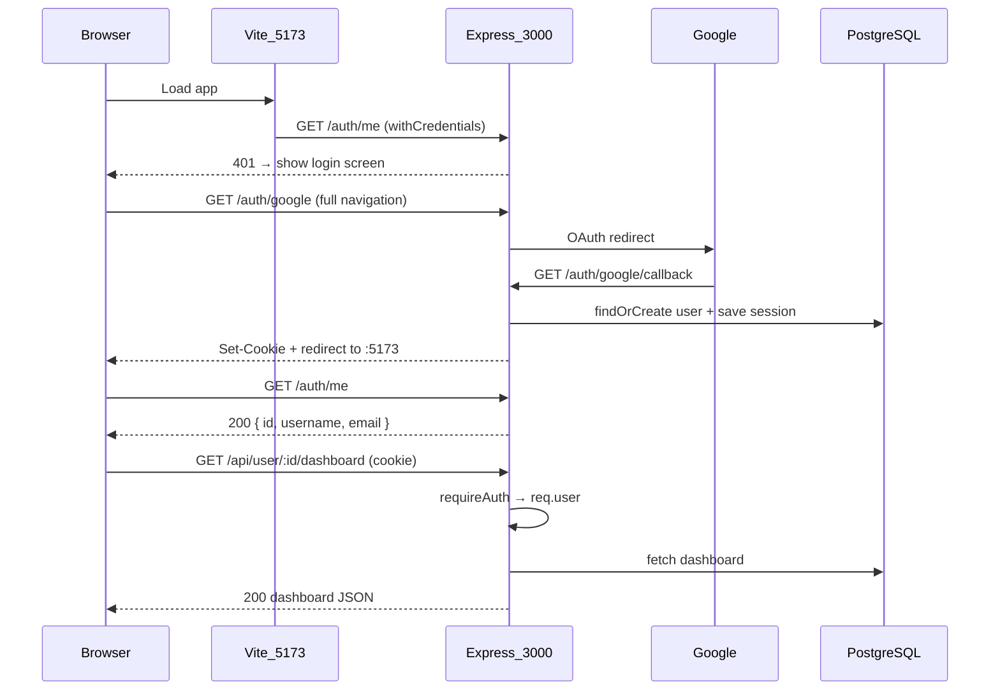

# Phase 5 — Authentication Implementation Plan

## Current State

Phase 4 is wired up but auth is still stubbed/bypassed:

| Area                                                                           | Status                                                                                                              |
| ------------------------------------------------------------------------------ | ------------------------------------------------------------------------------------------------------------------- |
| [`server/src/routes/auth.ts`](server/src/routes/auth.ts)                       | Stub endpoints only (`sendStub`)                                                                                    |
| [`server/src/middleware/requireAuth.ts`](server/src/middleware/requireAuth.ts) | `SKIP_AUTH=true` bypass; checks `req.session.userId` but no session middleware exists                               |
| [`server/src/index.ts`](server/src/index.ts)                                   | CORS + `credentials: true` ready; no `express-session` / Passport                                                   |
| [`client/src/api/client.ts`](client/src/api/client.ts)                         | `withCredentials: true` already set                                                                                 |
| Frontend                                                                       | [`client/src/constants/userId.ts`](client/src/constants/userId.ts) exports `HARDCODED_USER_ID = 1` used in 6 places |
| Migrations                                                                     | `001`–`005` exist; **no `session` table yet**                                                                       |
| Dependencies                                                                   | Root [`package.json`](package.json) lacks Passport/session packages                                                 |

PRD Section 7 confirms: **Google OAuth via Passport, PostgreSQL session store (`connect-pg-simple`), session-based auth (no JWTs).** Only `/auth/*` and `/health` are public.

---

## Architecture



**Localhost cookie note:** Chromium treats all `localhost` ports as same-site, so `SameSite=Lax` + `secure: false` (per Phase 5 prompt) should allow the session cookie set by `:3000` to be sent on XHR from `:5173`. No Vite proxy change required unless testing reveals otherwise.

---

## Prerequisites (manual — before coding)

Confirm in Google Cloud Console and [`server/.env`](server/.env) (gitignored):

- OAuth 2.0 Client ID + Secret
- Authorized redirect URI: `http://localhost:3000/auth/google/callback`
- Env vars: `GOOGLE_CLIENT_ID`, `GOOGLE_CLIENT_SECRET`, `SESSION_SECRET`
- Remove `SKIP_AUTH=true` from `server/.env` when testing auth

Update [`.env.example`](.env.example): remove `SKIP_AUTH`, uncomment Phase 5 vars.

---

## 1. Dependencies

Install in root (where server deps live):

```bash
npm install passport passport-google-oauth20 express-session connect-pg-simple
npm install -D @types/passport @types/passport-google-oauth20 @types/express-session
```

---

## 2. Session table migration

Create [`server/db/migrations/006_sessions.sql`](server/db/migrations/006_sessions.sql) exactly as specified in [`cursor-prompts/PHASE_5_AUTH.md`](cursor-prompts/PHASE_5_AUTH.md):

```sql
CREATE TABLE IF NOT EXISTS "session" ( ... );
CREATE INDEX IF NOT EXISTS "IDX_session_expire" ON "session" ("expire");
```

Run against the DB before testing (`psql "$DATABASE_URL" -f server/db/migrations/006_sessions.sql`).

---

## 3. Backend — session + Passport wiring

### 3a. Type augmentations

Extend [`server/src/types/express.d.ts`](server/src/types/express.d.ts):

- Add `req.user` shape: `{ id: number; username: string; email: string; google_id: string }` (minimal fields routes need)
- Add `declare module "express-session" { interface SessionData { userId: number } }` so `req.session.userId` is typed

### 3b. Auth service (business logic out of routes)

Create [`server/src/services/authService.ts`](server/src/services/authService.ts):

- `findOrCreateUserByGoogle(profile)` — `SELECT` by `google_id`; on miss `INSERT` with `google_id`, `email`, `username` (from `profile.displayName` or email local-part fallback)
- `getUserById(id)` — returns user row or `null`
- Use existing [`pool`](server/src/db/index.ts); parameterized queries only

### 3c. Passport Google strategy

Create [`server/src/config/passport.ts`](server/src/config/passport.ts) (or inline in auth routes if kept small):

- `GoogleStrategy` with scopes `["profile", "email"]`
- Callback receives profile → calls `findOrCreateUserByGoogle` → `done(null, user)`
- `passport.serializeUser((user, done) => done(null, user.id))`
- `passport.deserializeUser` can be a lightweight pass-through (full fetch happens in `requireAuth`)

### 3d. Wire middleware in [`server/src/index.ts`](server/src/index.ts)

Order matters — insert **after** `cors` + `express.json`, **before** routes:

```typescript
import session from "express-session";
import connectPgSimple from "connect-pg-simple";
import passport from "passport";
import { pool } from "./db/index";
import "./config/passport"; // registers strategy

const PgSession = connectPgSimple(session);

app.use(
  session({
    secret: process.env.SESSION_SECRET!, // fail fast if missing
    resave: false,
    saveUninitialized: false,
    store: new PgSession({ pool, tableName: "session" }),
    cookie: { secure: process.env.NODE_ENV === "production" },
  }),
);
app.use(passport.initialize());
app.use(passport.session());
```

Keep existing CORS config (`credentials: true`, localhost origin allowlist).

---

## 4. Backend — auth routes

Replace stubs in [`server/src/routes/auth.ts`](server/src/routes/auth.ts):

| Route                       | Behavior                                                                                                                                                |
| --------------------------- | ------------------------------------------------------------------------------------------------------------------------------------------------------- |
| `GET /auth/google`          | `passport.authenticate("google", { scope: ["profile", "email"] })`                                                                                      |
| `GET /auth/google/callback` | `passport.authenticate("google", { failureRedirect: "/auth/error" })` → on success set `req.session.userId = user.id`, redirect `http://localhost:5173` |
| `GET /auth/logout`          | `req.session.destroy()` → redirect `http://localhost:5173`                                                                                              |
| `GET /auth/me`              | If `req.session.userId` missing → `401 { error: "Unauthorized" }`; else fetch user → `{ id, username, email }`                                          |
| `GET /auth/error`           | Simple JSON or minimal HTML error page (failure redirect target)                                                                                        |

**Not behind `requireAuth`** — mounted at `/auth` before the `/api` router.

---

## 5. Backend — update `requireAuth`

Rewrite [`server/src/middleware/requireAuth.ts`](server/src/middleware/requireAuth.ts):

1. **Remove** entire `SKIP_AUTH` branch
2. If `req.session.userId === undefined` → `401 { error: "Unauthorized" }`
3. Else call `getUserById(req.session.userId)`:
   - User not found → `401` (stale session)
   - Found → attach to `req.user`, call `next()`

---

## 6. Backend — use `req.user.id` in protected routes

Phase 5 says replace hardcoded user IDs with session user. Backend routes currently parse `:id` from URL — switch to **`req.user.id`** as the source of truth and add an **authorization guard** so users cannot access another user's data:

```typescript
const routeUserId = parseInt(req.params["id"], 10);
if (isNaN(routeUserId) || routeUserId !== req.user!.id) {
  res.status(403).json({ error: "Forbidden." });
  return;
}
const userId = req.user!.id;
```

Apply in:

- [`server/src/routes/user.ts`](server/src/routes/user.ts) — `/:id/dashboard`
- [`server/src/routes/wishlist.ts`](server/src/routes/wishlist.ts) — all 3 handlers
- [`server/src/routes/quests.ts`](server/src/routes/quests.ts) — quest complete
- [`server/src/routes/webhooks.ts`](server/src/routes/webhooks.ts) — validate `payload.user_id === req.user!.id` before calling `processTransaction`

[`server/src/routes/admin.ts`](server/src/routes/admin.ts) remains a stub — no change needed for Phase 5.

---

## 7. Frontend — auth API + hook

### 7a. [`client/src/api/auth.ts`](client/src/api/auth.ts)

```typescript
export interface AuthUser {
  id: number;
  username: string;
  email: string;
}
export async function fetchMe(): Promise<AuthUser>; // GET /auth/me
export function getGoogleLoginUrl(): string; // returns VITE_API_URL + '/auth/google'
export function getLogoutUrl(): string; // returns VITE_API_URL + '/auth/logout'
```

Uses existing [`apiClient`](client/src/api/client.ts) for `/auth/me`; login/logout are full-page navigations to backend URLs (not axios).

### 7b. [`client/src/hooks/useAuth.ts`](client/src/hooks/useAuth.ts)

State: `{ user: AuthUser | null; loading: boolean; error: string | null }`

- On mount: call `fetchMe()`
  - 200 → set user
  - 401 → set user to `null` (not an error)
  - Other errors → set error string
- `logout()`: `window.location.href = getLogoutUrl()` (session destroyed server-side)
- Export `userId: user?.id ?? null` for downstream hooks/components

**Loading gate:** `loading === true` until first `/auth/me` resolves — prevents login-screen flash.

---

## 8. Frontend — gate app + replace hardcoded IDs

### 8a. [`client/src/App.tsx`](client/src/App.tsx)

- Call `useAuth()` at top level
- **Loading:** centered spinner / "Loading…" (dark theme, accent `#4A90D9`)
- **Not logged in:** simple login screen — app title + "Sign in with Google" `<a href={getGoogleLoginUrl()}>` (full navigation, not a button handler)
- **Logged in:** render existing nav + routes unchanged (no layout changes per Phase 5 rules)
- Add **Logout** button in nav → calls `logout()` from hook

### 8b. Remove [`client/src/constants/userId.ts`](client/src/constants/userId.ts)

Pass real `userId` from auth into hooks/components:

| File                                                                                 | Change                                                                      |
| ------------------------------------------------------------------------------------ | --------------------------------------------------------------------------- |
| [`client/src/hooks/useDashboard.ts`](client/src/hooks/useDashboard.ts)               | Accept `userId: number \| null`; skip fetch when null; add `userId` to deps |
| [`client/src/hooks/useWishlist.ts`](client/src/hooks/useWishlist.ts)                 | Same pattern                                                                |
| [`client/src/pages/Dashboard.tsx`](client/src/pages/Dashboard.tsx)                   | Receive `userId` prop from App (only rendered when logged in)               |
| [`client/src/pages/Vault.tsx`](client/src/pages/Vault.tsx)                           | Same                                                                        |
| [`client/src/components/DevToolsPanel.tsx`](client/src/components/DevToolsPanel.tsx) | Accept `userId` prop; use in webhook payload                                |

Pages/hooks only mount when authenticated, so `userId` is always defined at call sites.

---

## 9. Cleanup

- Delete all `TODO: replace with session user ID after Phase 5` comments
- Remove every `SKIP_AUTH` reference from codebase and [`.env.example`](.env.example)
- Do **not** change game logic, wishlist/dashboard services, or UI layout beyond login screen + logout button

---

## 10. Manual test checklist (exit criteria)

1. Logged out → app shows login screen (no dashboard flash)
2. "Sign in with Google" → OAuth → redirect to `:5173` → app loads
3. `GET /auth/me` returns correct `{ id, username, email }`
4. Postman `GET /api/user/1/dashboard` **without cookie** → `401`
5. Same request **with session cookie** (copy from browser devtools) → `200`
6. Dashboard, Vault, quest complete, webhook DevTools all work post-login
7. Logout → session destroyed → login screen returns
8. Second Google account → new `users` row; separate XP/state (no shared data)
9. Grep confirms zero `SKIP_AUTH` and zero `HARDCODED_USER_ID` in codebase

---

## Files touched (summary)

**Create:** `006_sessions.sql`, `authService.ts`, `passport.ts` (config), `client/src/api/auth.ts`, `client/src/hooks/useAuth.ts`

**Modify:** `index.ts`, `auth.ts`, `requireAuth.ts`, `express.d.ts`, `user.ts`, `wishlist.ts`, `quests.ts`, `webhooks.ts`, `App.tsx`, dashboard/wishlist hooks + pages, `DevToolsPanel.tsx`, `.env.example`

**Delete:** `client/src/constants/userId.ts`
