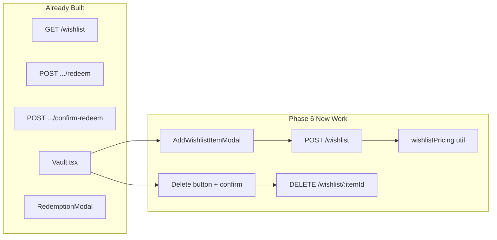

# Phase 6 — Vault & Wishlist Implementation Plan

**Prerequisite:** Phase 5 (Auth) is complete. This phase adds wishlist CRUD UI and verifies redemption. Do **not** change auth, game logic engine, DB schema, or dashboard code.

---

## Current State

| Area                                                                               | Status                                                        |
| ---------------------------------------------------------------------------------- | ------------------------------------------------------------- |
| [`server/src/routes/wishlist.ts`](server/src/routes/wishlist.ts)                   | GET + redeem + confirm-redeem only — **no POST/DELETE**       |
| [`server/src/services/wishlistService.ts`](server/src/services/wishlistService.ts) | `getWishlist`, `validateRedeem`, `confirmRedeem` complete     |
| [`server/src/constants/gameConfig.ts`](server/src/constants/gameConfig.ts)         | `WISHLIST_PRICING_TIERS` defined (Section 4.4) but **unused** |
| [`client/src/pages/Vault.tsx`](client/src/pages/Vault.tsx)                         | Read-only grid + redemption modal — **no add/delete**         |
| [`client/src/components/WishlistItem.tsx`](client/src/components/WishlistItem.tsx) | Affordable / locked / UNLOCKED states + Redeem button         |
| [`client/src/pages/Onboarding.tsx`](client/src/pages/Onboarding.tsx)               | Duplicate inline `suggestTokenCost()` (string labels only)    |
| Redemption flow                                                                    | Wired in Phase 4 — appears complete; needs smoke test         |



---

## 1. Shared Token Pricing Helper

PRD Section 4.4 tiers (already mirrored in `WISHLIST_PRICING_TIERS`):

| Price (ZAR) | Cost        |
| ----------- | ----------- |
| &lt; 50     | 1 Micro     |
| 50 – 150    | 1 Standard  |
| 150 – 400   | 2 Standard  |
| 400 – 800   | 3 Standard  |
| &gt; 800    | Manual only |

**Approach:** Create a single server-side helper and mirror it on the client (Phase 6 allows this if both are tested). Avoid a new `shared/` folder — that would require tsconfig/vite changes outside PRD Section 12.

**Server:** [`server/src/utils/wishlistPricing.ts`](server/src/utils/wishlistPricing.ts)

```typescript
export type SuggestedTokenCost =
  | { tokenCost: number; tokenType: "MICRO" | "STANDARD" }
  | { manualRequired: true };

export function suggestWishlistTokenCost(priceZar: number): SuggestedTokenCost;
```

- Iterate `WISHLIST_PRICING_TIERS` from [`gameConfig.ts`](server/src/constants/gameConfig.ts)
- Boundary rule: `priceZar >= tier.minPriceZar && (tier.maxPriceZar === null || priceZar < tier.maxPriceZar)` — matches existing Onboarding logic (`< 50` → Micro, `50` → Standard)

**Tests:** [`server/src/utils/wishlistPricing.test.ts`](server/src/utils/wishlistPricing.test.ts) — vitest cases at boundaries: 49.99, 50, 149.99, 150, 399.99, 400, 799.99, 800, 800.01

**Client:** [`client/src/utils/wishlistPricing.ts`](client/src/utils/wishlistPricing.ts) — same function signature and tier boundaries (duplicate constants, not import from server)

**Refactor:** Replace inline `suggestTokenCost()` in [`Onboarding.tsx`](client/src/pages/Onboarding.tsx) with the client util (format labels in the component). Keeps pricing logic in one place per side.

---

## 2. Backend — Add Wishlist Item

### Service: `addWishlistItem` in [`wishlistService.ts`](server/src/services/wishlistService.ts)

```typescript
interface AddWishlistItemInput {
  item_name: string;
  price_zar: number;
  token_cost?: number;
  token_type?: "MICRO" | "STANDARD";
}
```

Logic (all in service, not route):

1. Trim `item_name`; reject empty → throw `WishlistError` (400)
2. Reject `price_zar <= 0` or non-finite → 400
3. Resolve token fields:
   - If **both** `token_cost` and `token_type` provided → validate `token_cost >= 1`, type is MICRO|STANDARD
   - If **neither** provided → call `suggestWishlistTokenCost(price_zar)`; if `manualRequired` → 400 with message like `"Price over R800 requires manual token cost."`
   - If **only one** provided → 400 (partial override invalid)
4. Verify user exists (404 if not)
5. `INSERT INTO wishlist (user_id, item_name, price_zar, token_cost, token_type) VALUES (...) RETURNING *`
6. Return mapped `WishlistItem`

Add `WishlistError` class (same pattern as existing `RedeemError`).

### Route: `POST /:id/wishlist` in [`wishlist.ts`](server/src/routes/wishlist.ts)

- Same param guard as existing routes: `routeUserId !== req.user!.id` → 403
- Parse body fields; delegate to `addWishlistItem`
- Return 201 + created item JSON

**Route order:** Register `POST /:id/wishlist` **before** `POST /:id/wishlist/:itemId/redeem` (already separate path segments — no conflict, but keep grouped logically).

---

## 3. Backend — Delete Wishlist Item

### Service: `deleteWishlistItem(userId, itemId)`

1. Fetch item `WHERE id = $1 AND user_id = $2`
2. Not found → 403 (per Phase 6 prompt: item doesn't belong to user)
3. `is_purchased === true` → 400 `"Cannot delete a purchased item."`
4. `DELETE FROM wishlist WHERE id = $1`
5. Return `{ success: true }`

### Route: `DELETE /:id/wishlist/:itemId`

- Same auth/param guard pattern
- Return 200 + `{ success: true }`

---

## 4. Frontend API Layer

Extend [`client/src/api/wishlist.ts`](client/src/api/wishlist.ts):

```typescript
export interface AddWishlistItemPayload {
  item_name: string;
  price_zar: number;
  token_cost?: number;
  token_type?: "MICRO" | "STANDARD";
}

export async function addWishlistItem(userId, payload): Promise<WishlistItem>;
export async function deleteWishlistItem(
  userId,
  itemId,
): Promise<{ success: true }>;
```

Add response types to [`client/src/api/types.ts`](client/src/api/types.ts) if needed.

---

## 5. Frontend — AddWishlistItemModal

New component: [`client/src/components/AddWishlistItemModal.tsx`](client/src/components/AddWishlistItemModal.tsx)

| Field                | Behavior                                                                             |
| -------------------- | ------------------------------------------------------------------------------------ |
| `item_name`          | Text input, required                                                                 |
| `price_zar`          | Number input, required, positive                                                     |
| Suggested Token Cost | Read-only; updates on every price change via `suggestWishlistTokenCost()`            |
| Override toggle      | "Use suggested cost" (default on) / "Set manually"                                   |
| Manual fields        | Shown when toggle off **or** price &gt; 800 (force manual, disable suggested toggle) |
| Manual: token cost   | Number input, min 1                                                                  |
| Manual: token type   | Dropdown MICRO \| STANDARD                                                           |
| Submit               | "Add to Vault" → `addWishlistItem()`                                                 |
| Success              | `onSuccess()` → parent closes modal + `refetch()`                                    |
| Error                | Display inside modal; do not close                                                   |

Modal styling: match [`RedemptionModal.tsx`](client/src/components/RedemptionModal.tsx) (fixed overlay, `#1a1a1a` card, accent button).

Suggested cost display examples:

- `{ tokenCost: 1, tokenType: "MICRO" }` → `"1 Micro-Token"`
- `{ manualRequired: true }` → `"Set manually (required for prices over R800)"`

Payload construction:

- Suggested mode: send only `{ item_name, price_zar }` — let server calculate
- Manual mode: send `{ item_name, price_zar, token_cost, token_type }`

---

## 6. Frontend — Vault Page Updates

[`client/src/pages/Vault.tsx`](client/src/pages/Vault.tsx):

- Add `"Add Item"` button next to the Vault heading
- `useState` for modal open/close
- Render `AddWishlistItemModal` when open
- Pass `onSuccess={() => { setModalOpen(false); refetch(); }}`

---

## 7. Frontend — Delete Item UI

Extend [`client/src/components/WishlistItem.tsx`](client/src/components/WishlistItem.tsx):

- Add props: `onDelete?: (item) => void`, `isConfirmingDelete?: boolean`, `showDeleteConfirm?: boolean`
- **Purchased items:** no delete control (existing UNLOCKED branch unchanged)
- **Non-purchased items:** small delete icon/button (top-right)
- Click delete → inline confirm text `"Remove this item?"` with Confirm / Cancel (not a modal)
- Parent [`Vault.tsx`](client/src/pages/Vault.tsx) tracks `confirmingDeleteId`, calls `deleteWishlistItem`, refetches on success, shows inline error on failure

Alternatively keep confirm state inside `WishlistItem` with an `onDeleteConfirmed(itemId)` callback — either works; prefer local confirm state in the component with a single `onDelete(itemId)` async callback from Vault.

---

## 8. Redemption Flow — Verify (No Changes Expected)

Smoke-test the existing implementation before marking Phase 6 done:

| Check                                           | Where verified                                                                                    |
| ----------------------------------------------- | ------------------------------------------------------------------------------------------------- |
| Redeem button only on affordable items          | [`WishlistItem.tsx`](client/src/components/WishlistItem.tsx) `isAffordable` branch                |
| Step 1 validates balance server-side            | [`validateRedeem()`](server/src/services/wishlistService.ts)                                      |
| Step 2 re-validates + deducts + marks purchased | [`confirmRedeem()`](server/src/services/wishlistService.ts) transaction                           |
| Token count updates after redemption            | [`Vault.tsx`](client/src/pages/Vault.tsx) `refetch()` after confirm; tokens shown in Vault header |
| UNLOCKED stamp, no Redeem button                | [`WishlistItem.tsx`](client/src/components/WishlistItem.tsx) `is_purchased` branch                |

**Note:** App nav ([`App.tsx`](client/src/App.tsx)) does not show token counts; PRD allows "header or sidebar." Vault page subtitle satisfies this for the redemption flow. No dashboard changes needed.

**End-to-end test path:**

1. DevTools webhook → earn XP → level up to 5 or 10 for tokens
2. Add item via modal (e.g. R30 → 1 Micro)
3. Redeem → confirm → toast `"Unlocked: [Item Name]. Go get it."`
4. Item shows UNLOCKED; token count decremented
5. Try `DELETE` on purchased item via API → 400

Direct `POST .../confirm-redeem` without step 1 still fails if insufficient tokens (independent server-side check in `confirmRedeem`). No session gate between steps — acceptable per current architecture.

---

## Files to Create / Modify

| Action | File                                                                      |
| ------ | ------------------------------------------------------------------------- |
| Create | `server/src/utils/wishlistPricing.ts`                                     |
| Create | `server/src/utils/wishlistPricing.test.ts`                                |
| Create | `client/src/utils/wishlistPricing.ts`                                     |
| Create | `client/src/components/AddWishlistItemModal.tsx`                          |
| Modify | `server/src/services/wishlistService.ts` — add + delete + `WishlistError` |
| Modify | `server/src/routes/wishlist.ts` — POST + DELETE routes                    |
| Modify | `client/src/api/wishlist.ts` — add + delete API functions                 |
| Modify | `client/src/api/types.ts` — payload types                                 |
| Modify | `client/src/pages/Vault.tsx` — Add Item button + modal + delete handler   |
| Modify | `client/src/components/WishlistItem.tsx` — delete UI                      |
| Modify | `client/src/pages/Onboarding.tsx` — use client pricing util (DRY)         |

**Out of scope:** auth, game logic, DB migrations, dashboard, new npm packages.

---

## Exit Criteria Checklist

- [ ] Add item via modal → appears in Vault immediately
- [ ] Suggested token cost updates in real time as price is typed
- [ ] Manual override saves correct `token_cost` + `token_type` to DB
- [ ] Delete non-purchased item → disappears from Vault
- [ ] Purchased items: no delete button; API returns 400
- [ ] Full flow: webhook → earn tokens → redeem → UNLOCKED → tokens decremented
- [ ] `npm test` passes (new pricing unit tests)
- [ ] `suggestWishlistTokenCost` boundary tests cover all PRD tiers
