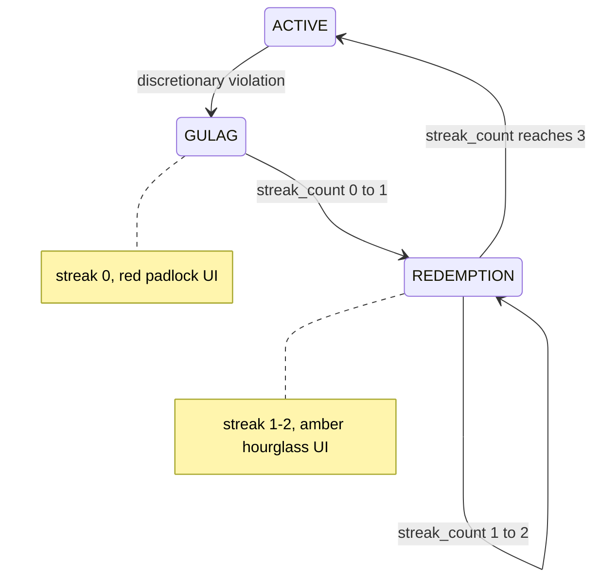

# Phase 7 — Gulag UI Implementation Plan

## Current State vs Gaps

**Already working (Phase 2 + 4):**

- Violation path in [`server/src/services/gameLogicEngine.ts`](server/src/services/gameLogicEngine.ts): ACTIVE + quest violation → `state = 'GULAG'`, inserts `GULAG_REDEMPTION` quest (`streak_count = 0`), entry toast fires
- GULAG + discretionary → stays GULAG, `is_violation = true`, no XP
- GULAG + FIXED_BILL → balance deducted, no violation
- [`server/src/services/dashboardService.ts`](server/src/services/dashboardService.ts) already returns active quests including `GULAG_REDEMPTION` with `streak_count`
- [`client/src/pages/Dashboard.tsx`](client/src/pages/Dashboard.tsx) reads real API data; passes streak to overlay
- Manual completion of `GULAG_REDEMPTION` blocked in [`server/src/routes/quests.ts`](server/src/routes/quests.ts)

**Missing (Phase 7 scope):**

- Streak increment / GULAG exit logic (no code advances `streak_count` today)
- `GULAG → REDEMPTION` transition (Phase 2 deliberately deferred; user stays `GULAG` at streak 0)
- Gulag progress + exit toasts
- 50 XP award on redemption completion (PRD Section 4.3)
- `last_streak_date` column + idempotency guard
- Dashboard shows `GulagOverlay` only for `GULAG`, not `REDEMPTION`
- [`client/src/components/GulagOverlay.tsx`](client/src/components/GulagOverlay.tsx) is a stub (fake XP bar, wrong header copy, default `streakCount = 1`)



---

## Part 1 — Verify Backend Entry Path (before UI work)

Manual smoke test via DevTools + DB (no code changes unless failing):

| Step | Action                                                            | Expected                                                                   |
| ---- | ----------------------------------------------------------------- | -------------------------------------------------------------------------- |
| 1    | User ACTIVE with Zero Spend Day quest; fire DISCRETIONARY webhook | `users.state = 'GULAG'`, toast `"Violation detected. Battle Pass frozen."` |
| 2    | Check `quests` table                                              | `GULAG_REDEMPTION` row, `streak_count = 0`, `status = 'ACTIVE'`            |
| 3    | Fire DISCRETIONARY while GULAG                                    | State stays GULAG, no XP change                                            |
| 4    | Fire FIXED_BILL while GULAG                                       | State stays GULAG, `is_violation = false`                                  |

If step 1–3 fail, fix engine before proceeding.

---

## Part 2 — Database Migration

Create [`server/db/migrations/007_quests_streak_date.sql`](server/db/migrations/007_quests_streak_date.sql):

```sql
ALTER TABLE quests ADD COLUMN last_streak_date DATE;
```

Run against dev DB before testing streak logic.

Update backend `QuestRow` in [`server/src/types/gameLogic.ts`](server/src/types/gameLogic.ts) to include `last_streak_date: string | null` (DATE comes back as string from `pg`).

Extend SELECT queries in `gameLogicEngine` (and any streak helper) to fetch `last_streak_date`.

---

## Part 3 — Gulag Streak Service (core backend work)

Extract streak logic into a new service — keeps [`gameLogicEngine.ts`](server/src/services/gameLogicEngine.ts) readable and independently testable (PRD Section 9):

**New file:** [`server/src/services/gulagStreakService.ts`](server/src/services/gulagStreakService.ts)

**Constants:** use `GULAG_REDEMPTION_STREAK_DAYS` (3) from [`server/src/constants/gameConfig.ts`](server/src/constants/gameConfig.ts).

### When to call

Invoke `tryAdvanceGulagStreak(client, userId, user, referenceDate)` from `processTransaction` when:

- User state is `GULAG` or `REDEMPTION`
- Active `GULAG_REDEMPTION` quest exists
- Incoming webhook is **non-violating** (FIXED_BILL, or DISCRETIONARY in the existing REDEMPTION branch)
- Call **before** inserting the current transaction so today's spend doesn't affect evaluation of a prior day

Do **not** call on GULAG + discretionary (always violating per PRD Section 9).

### Calendar day rules

- Use the webhook `payload.timestamp` parsed to a **server-local calendar date** as `referenceDate` (not `new Date()` — required for multi-day DevTools testing)
- A qualifying zero day = **zero DISCRETIONARY transactions** on that date (matches PRD quest title "zero discretionary"; stricter than `is_violation` alone)
- Evaluate **yesterday** relative to `referenceDate`: `candidateDate = referenceDate - 1 day`
- Skip if `candidateDate <= date(quest.created_at)` (violation day never counts)
- Skip if `last_streak_date >= candidateDate` (same day cannot count twice — exit criteria #4)

### Consecutive-day logic

- If `last_streak_date` is set and `candidateDate > last_streak_date + 1 day` → streak breaks; if yesterday qualifies, reset to `streak_count = 1` (not increment from prior)
- If `last_streak_date + 1 day === candidateDate` and yesterday qualifies → `streak_count += 1`
- If `last_streak_date` is null and yesterday qualifies → `streak_count = 1` (first completed day)

### State transitions + completion

| After increment                              | Action                                                                                                                                                  |
| -------------------------------------------- | ------------------------------------------------------------------------------------------------------------------------------------------------------- |
| `streak_count === 1` and `state === 'GULAG'` | `UPDATE users SET state = 'REDEMPTION'`                                                                                                                 |
| `streak_count === 3`                         | `quest.status = 'COMPLETE'`, `users.state = 'ACTIVE'`, call `applyXpAndLevelUp` with quest `xp_reward` (50), append level-up/token toasts if applicable |

Return `{ newState, streakCount, toastMessages }` to merge into `GameEngineResult`.

### Toast messages (PRD Section 10 — user confirmed)

Add helper in streak service or [`server/src/constants/gameConfig.ts`](server/src/constants/gameConfig.ts):

```typescript
function gulagProgressToast(streakCount: number): string {
  const remaining = GULAG_REDEMPTION_STREAK_DAYS - streakCount;
  if (remaining === 1) return `Day ${streakCount} of 3 complete. One more.`;
  return `Day ${streakCount} of 3 complete. ${remaining} more.`;
}
```

- Streak progress (streak 1 or 2): use helper above
- Gulag exit (streak 3): `"Redemption complete. Battle Pass unlocked."` (+ XP toast from `applyXpAndLevelUp` if needed)
- Entry toast already correct in engine — verify only

### Engine integration points

Modify [`server/src/services/gameLogicEngine.ts`](server/src/services/gameLogicEngine.ts):

1. **GULAG + FIXED_BILL branch** — after balance/transaction insert, call streak service; merge returned state/toasts
2. **REDEMPTION branch** — same streak call on non-violating webhooks; merge results
3. Pass `payload.timestamp` into streak evaluation throughout

Keep existing violation / XP-freeze branches unchanged.

---

## Part 4 — Dashboard API (verify only)

[`server/src/services/dashboardService.ts`](server/src/services/dashboardService.ts) already selects active quests with `streak_count`. **No endpoint change expected** unless manual verification shows `GULAG_REDEMPTION` missing after violation — in that case, confirm the quest insert + dashboard query filter (`status = 'ACTIVE'`) are aligned.

Frontend should continue using a single dashboard fetch (no separate quest call).

---

## Part 5 — Frontend: GulagOverlay + Dashboard

### Expand [`client/src/components/GulagOverlay.tsx`](client/src/components/GulagOverlay.tsx)

New props:

```typescript
interface GulagOverlayProps {
  userState: "GULAG" | "REDEMPTION";
  streakCount: number;
  currentXP: number;
  xpToNext: number;
  questTitle?: string;
}
```

Render per Phase 7 + PRD Section 10:

| Element       | GULAG (`streakCount === 0`)                                                                                                | REDEMPTION (`streakCount >= 1`)                                 |
| ------------- | -------------------------------------------------------------------------------------------------------------------------- | --------------------------------------------------------------- |
| Header        | `"BATTLE PASS LOCKED"`                                                                                                     | Same                                                            |
| Badge accent  | Red border/bg (`border-red-900`, `text-red-400`)                                                                           | Amber (`border-amber-900`, `text-amber-400`)                    |
| Reason        | `"Violation detected. Complete your Redemption Quest to unlock."`                                                          | Same                                                            |
| XP bar        | Reuse [`XPBar`](client/src/components/XPBar.tsx) with real `currentXP`/`xpToNext` + `isGulag={true}` (grayscale + padlock) | Same bar desaturated, but **hourglass icon** instead of padlock |
| Streak        | `Day {streakCount} of 3` with dot indicators                                                                               | Prominent: `Day {streakCount} of 3 — Keep going.`               |
| Quest         | Show `questTitle` (from dashboard quest)                                                                                   | Same                                                            |
| How to escape | Plaintext: 3 consecutive days with no discretionary spending                                                               | Same                                                            |

Remove fake `w-3/4` progress bar and default `streakCount = 1`.

### Update [`client/src/pages/Dashboard.tsx`](client/src/pages/Dashboard.tsx)

Replace:

```typescript
const isGulag = user.state === "GULAG";
```

With:

```typescript
const isBattlePassLocked =
  user.state === "GULAG" || user.state === "REDEMPTION";
```

When locked, render `GulagOverlay` with `userState`, real XP values, and `gulagQuest?.title`. Remove the separate REDEMPTION-only amber text under `XPBar` (overlay subsumes it).

Keep state badge colours as-is (GULAG red pulse, REDEMPTION amber).

Optional: hide `GULAG_REDEMPTION` from the quest list below the fold since overlay shows it prominently — not required by prompt; can leave in list with no Complete button (already enforced).

---

## Part 6 — DevTools: Multi-Day Testing Support

Exit criteria require firing non-violating webhooks on **new days**. [`DevToolsPanel.tsx`](client/src/components/DevToolsPanel.tsx) currently hardcodes `timestamp: new Date().toISOString()`.

Add an optional **Timestamp** input (datetime-local or ISO string field, defaulting to now). Pass user-provided value in the webhook payload so streak service can simulate consecutive days without DB edits.

Suggested manual loop:

1. Violation → GULAG, streak 0
2. Next day: FIXED_BILL webhook with timestamp +1 day → streak 1, REDEMPTION
3. Repeat for days 2 and 3 → ACTIVE, overlay gone, XP bar normal

---

## Part 7 — Tests

Extend [`server/src/services/gameLogicEngine.test.ts`](server/src/services/gameLogicEngine.test.ts) and/or add [`server/src/services/gulagStreakService.test.ts`](server/src/services/gulagStreakService.test.ts):

| Test                                             | Assert                                                        |
| ------------------------------------------------ | ------------------------------------------------------------- |
| GULAG + FIXED_BILL, yesterday zero discretionary | `streak_count = 1`, `newState = 'REDEMPTION'`, progress toast |
| Same-day second FIXED_BILL                       | `streak_count` unchanged                                      |
| Third consecutive zero day                       | `state = 'ACTIVE'`, quest COMPLETE, 50 XP, exit toast         |
| GULAG + discretionary                            | No streak advance (existing test stays)                       |
| Day with discretionary spend                     | Yesterday not counted / streak resets per consecutive rules   |

Mock `pg` client same pattern as existing engine tests.

---

## Part 8 — Exit Criteria Checklist

Map Phase 7 exit criteria to verification steps:

- [ ] Violation webhook → dashboard refetch → GulagOverlay + `streak_count = 0`
- [ ] Non-violating webhook on new day → `streak_count + 1`, UI counter updates
- [ ] Two non-violating webhooks same day → no double increment
- [ ] After 3 streak days → `ACTIVE`, normal XP bar, overlay hidden
- [ ] `REDEMPTION` → amber badge + hourglass (not red padlock)
- [ ] All 3 Gulag toasts at correct moments (entry, progress with PRD wording, exit)
- [ ] Full loop end-to-end via DevTools + timestamp control, no manual DB edits

---

## Files to Create / Modify

| File                                                                                                 | Action                                  |
| ---------------------------------------------------------------------------------------------------- | --------------------------------------- |
| [`server/db/migrations/007_quests_streak_date.sql`](server/db/migrations/007_quests_streak_date.sql) | Create                                  |
| [`server/src/services/gulagStreakService.ts`](server/src/services/gulagStreakService.ts)             | Create                                  |
| [`server/src/services/gameLogicEngine.ts`](server/src/services/gameLogicEngine.ts)                   | Modify — integrate streak + timestamp   |
| [`server/src/types/gameLogic.ts`](server/src/types/gameLogic.ts)                                     | Modify — `last_streak_date` on QuestRow |
| [`server/src/services/gameLogicEngine.test.ts`](server/src/services/gameLogicEngine.test.ts)         | Modify — streak tests                   |
| [`client/src/components/GulagOverlay.tsx`](client/src/components/GulagOverlay.tsx)                   | Modify — full UI                        |
| [`client/src/pages/Dashboard.tsx`](client/src/pages/Dashboard.tsx)                                   | Modify — GULAG + REDEMPTION overlay     |
| [`client/src/components/DevToolsPanel.tsx`](client/src/components/DevToolsPanel.tsx)                 | Modify — timestamp input                |

**No new pages.** Do not alter PRD state machine semantics beyond implementing deferred streak/REDEMPTION transitions defined in Section 5.
