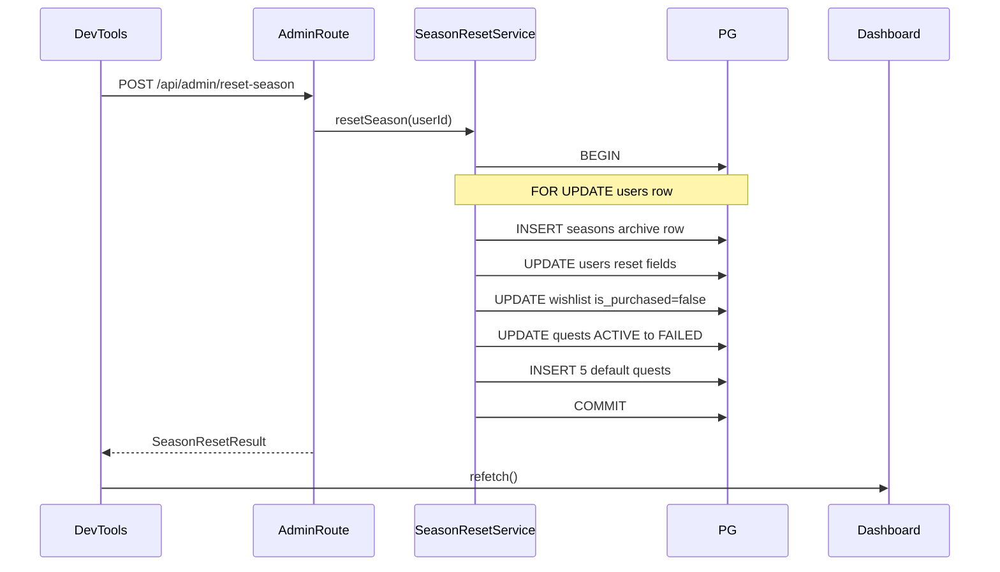

# Phase 8 — Season Reset Implementation Plan

## Scope and constraints

- **In scope:** [`cursor-prompts/PHASE_8_SEASON_RESET.md`](cursor-prompts/PHASE_8_SEASON_RESET.md) only — no cron, no new pages, no changes to [`gameLogicEngine.ts`](server/src/services/gameLogicEngine.ts).
- **PRD alignment:** Flow 4 ([`PRD.md`](PRD.md) §6) — reset XP/level/tokens, regenerate quests, preserve wishlist (`is_purchased = false`), archive to `seasons`. **Do not** reset `playable_balance` or delete wishlist rows.
- **Auth:** All `/api/*` already behind [`requireAuth`](server/src/middleware/requireAuth.ts). Reset and history are **self-only** (`route :id === req.user.id`), same pattern as [`user.ts`](server/src/routes/user.ts).

## Current state

| Piece                          | Status                                                                        |
| ------------------------------ | ----------------------------------------------------------------------------- |
| `seasons` table                | Exists — [`002_seasons.sql`](server/db/migrations/002_seasons.sql)            |
| `users.current_season_id`      | Column exists, **unused** in app code today                                   |
| `POST /api/admin/reset-season` | Stub in [`admin.ts`](server/src/routes/admin.ts)                              |
| `GET /api/user/:id/seasons`    | Not implemented (added by Phase 8 prompt; not in PRD §8.4 table)              |
| Default quest seeding          | No shared helper — quests likely inserted manually in dev DB                  |
| DevTools                       | Webhook only — [`DevToolsPanel.tsx`](client/src/components/DevToolsPanel.tsx) |

## Architecture



---

## 1. Backend types

Create [`server/src/types/seasonReset.ts`](server/src/types/seasonReset.ts):

```typescript
export interface SeasonResetResult {
  success: boolean;
  archivedSeasonId: number;
  seasonNumber: number;
  newSeasonStartDate: string; // ISO date string
}

export interface SeasonSummary {
  id: number;
  season_number: number;
  start_date: string;
  end_date: string;
  final_xp: number;
  final_level: number;
  final_tokens: number;
}
```

---

## 2. Quest seed helper (shared, config-driven)

Create [`server/src/services/questSeedService.ts`](server/src/services/questSeedService.ts) with:

```typescript
export async function seedDefaultQuests(
  client: PoolClient,
  userId: number,
): Promise<void>;
```

**Seed set (recommended): all 5 non-Gulag entries from [`QUEST_XP_VALUES`](server/src/constants/gameConfig.ts) + [`QUEST_TITLES`](server/src/constants/gameConfig.ts):**

| questKey            | title               | quest_type |
| ------------------- | ------------------- | ---------- |
| ZERO_SPEND_DAY      | Zero Spend Day      | DAILY      |
| UNDER_BUDGET_DAY    | Under Budget Day    | DAILY      |
| MEAL_PREP           | Meal Prep           | DAILY      |
| WEEKLY_STREAK       | Weekly Streak       | WEEKLY     |
| WEEKLY_UNDER_BUDGET | Weekly Under Budget | WEEKLY     |

- Map `resetCadence`: `DAILY` → `'DAILY'`, `WEEKLY` → `'WEEKLY'`; skip `ONE_TIME_PER_GULAG` (Gulag quest is created only by the engine on violation).
- Insert: `INSERT INTO quests (user_id, title, xp_reward, quest_type, status, streak_count) VALUES ($1, $2, $3, $4, 'ACTIVE', 0)` per row.
- Keeps XP values and titles in sync with `gameConfig` — no magic numbers in the reset service.

---

## 3. Season reset service (core)

Create [`server/src/services/seasonResetService.ts`](server/src/services/seasonResetService.ts):

```typescript
export async function resetSeason(userId: number): Promise<SeasonResetResult>;
```

**Transaction pattern** — mirror [`wishlistService.confirmRedeem`](server/src/services/wishlistService.ts) / [`gameLogicEngine.ts`](server/src/services/gameLogicEngine.ts):

1. `pool.connect()` → `BEGIN`
2. `SELECT ... FROM users WHERE id = $1 FOR UPDATE` — 404 if missing
3. Capture snapshot: `final_xp`, `final_level`, `final_tokens = micro + standard`, `current_season_id`
4. **Compute `season_number`:** `COALESCE((SELECT MAX(season_number) FROM seasons WHERE user_id = $1), 0) + 1`
5. **Compute `start_date` for archive row** (`start_date` is `NOT NULL` per schema; prompt omits it):
   - If `current_season_id` is set: `(SELECT end_date::date FROM seasons WHERE id = current_season_id)`
   - Else: `users.created_at::date`
6. **Archive INSERT:**

```sql
INSERT INTO seasons (user_id, season_number, start_date, end_date, final_xp, final_level, final_tokens)
VALUES ($1, $2, $3, CURRENT_DATE, $4, $5, $6)
RETURNING id, season_number, start_date
```

(`end_date = NOW()` from prompt → use `CURRENT_DATE` to match `DATE` column.)

7. **Reset user:**

```sql
UPDATE users SET
  current_xp = 0,
  level = 1,
  wishlist_tokens_micro = 0,
  wishlist_tokens_standard = 0,
  state = 'ACTIVE',
  current_season_id = $archivedId
WHERE id = $1
```

Use [`STARTING_LEVEL`](server/src/constants/gameConfig.ts) / `STARTING_XP` constants instead of literals.

8. **Wishlist:** `UPDATE wishlist SET is_purchased = false WHERE user_id = $1`
9. **Quests:** `UPDATE quests SET status = 'FAILED' WHERE user_id = $1 AND status = 'ACTIVE'`
10. **`seedDefaultQuests(client, userId)`**
11. `COMMIT` → return `{ success: true, archivedSeasonId, seasonNumber, newSeasonStartDate: CURRENT_DATE as ISO }`
12. On any error: `ROLLBACK`, rethrow; route maps to 500 + `error` message

**Out of scope for reset:** `playable_balance`, `transactions`, completed/failed quest history rows (left as-is).

---

## 4. Season history read service

Create [`server/src/services/seasonHistoryService.ts`](server/src/services/seasonHistoryService.ts) (or a `getSeasonsForUser` function in the same file as reset — prefer **separate small service** to keep reset transactional logic isolated):

```typescript
export async function getSeasonHistory(
  userId: number,
): Promise<SeasonSummary[]>;
```

```sql
SELECT id, season_number, start_date, end_date, final_xp, final_level, final_tokens
FROM seasons
WHERE user_id = $1
ORDER BY season_number DESC
```

Map `Date` → `toISOString().slice(0, 10)` (or full ISO) for JSON consistency.

---

## 5. Route wiring

### [`server/src/routes/admin.ts`](server/src/routes/admin.ts)

Replace stub:

- `resetSeason(req.user!.id)` inside try/catch
- `200` + `SeasonResetResult`
- `500` + `{ error: err.message }` (log server-side)

No `:id` param — logged-in user only (matches prompt).

### [`server/src/routes/user.ts`](server/src/routes/user.ts)

Add:

```typescript
router.get("/:id/seasons", async (req, res) => { ... })
```

- Same 403 guard as dashboard (`routeUserId !== req.user!.id`)
- Call `getSeasonHistory(req.user!.id)`
- Return `SeasonSummary[]`

---

## 6. Frontend API layer

| File                                                 | Change                                                                                         |
| ---------------------------------------------------- | ---------------------------------------------------------------------------------------------- |
| [`client/src/api/types.ts`](client/src/api/types.ts) | Add `SeasonSummary`, `SeasonResetResult` (mirror server)                                       |
| [`client/src/api/admin.ts`](client/src/api/admin.ts) | **New** — `resetSeason(): Promise<SeasonResetResult>` → `POST /api/admin/reset-season`         |
| [`client/src/api/user.ts`](client/src/api/user.ts)   | Add `fetchSeasonHistory(userId): Promise<SeasonSummary[]>` → `GET /api/user/${userId}/seasons` |

Use existing [`apiClient`](client/src/api/client.ts) + `extractErrorMessage` — no raw axios in components.

---

## 7. UI changes (minimal, per prompt)

### [`client/src/components/DevToolsPanel.tsx`](client/src/components/DevToolsPanel.tsx)

- Add prop: `onResetSuccess: () => void` (or reuse `onWebhookSuccess` for `refetch` — same callback).
- **Reset Season** button below webhook form.
- Inline confirm (local state): exact copy from prompt — _"This will reset XP, tokens, and lock the Wishlist. Season will be archived. Continue?"_
- On confirm: `resetSeason()` → show JSON result block (same mono style as webhook result) → `onResetSuccess()` / `refetch()`.
- Loading + error states matching existing webhook pattern.

### [`client/src/components/SeasonHistory.tsx`](client/src/components/SeasonHistory.tsx) (new)

- Collapsible section, **collapsed by default** (same toggle pattern as DevTools).
- On expand: fetch seasons once (or on each expand).
- Table columns per prompt:

| Season          | Level Reached | XP Earned  | Tokens Spent   |
| --------------- | ------------- | ---------- | -------------- |
| `season_number` | `final_level` | `final_xp` | `final_tokens` |

- Loading / error / empty states explicit.
- Note: column header says "Tokens Spent" but value is `final_tokens` (token balance at archive) — display as specified in Phase 8 prompt.

### [`client/src/pages/Dashboard.tsx`](client/src/pages/Dashboard.tsx)

- Import `SeasonHistory` — place **at bottom** of dashboard (after DevTools or before; prompt says bottom of Dashboard — put **Season History last**, DevTools above it is acceptable).
- Pass `userId` to `SeasonHistory`.
- Pass `refetch` to `DevToolsPanel` for post-reset refresh.

---

## 8. Manual verification (exit criteria)

1. User at Level 5+ with tokens and purchased wishlist item → DevTools reset → confirm.
2. DB: new `seasons` row with correct `final_xp`, `final_level`, `final_tokens` (micro + standard sum).
3. `users`: XP 0, level 1, tokens 0, `state = ACTIVE`, `current_season_id` updated.
4. Wishlist rows still exist, all `is_purchased = false`.
5. Dashboard shows Level 1, 0 XP, empty progress bar, fresh ACTIVE quests (5 seeded).
6. `GET /api/user/:id/seasons` returns archived row; Season History table shows it.
7. Second reset → `season_number` increments; two archive rows.
8. **Rollback test:** simulate failure mid-transaction (e.g. temporarily break SQL) — no partial user/quest/wishlist changes.

---

## Files summary

| Action | Path                                                |
| ------ | --------------------------------------------------- |
| Create | `server/src/types/seasonReset.ts`                   |
| Create | `server/src/services/questSeedService.ts`           |
| Create | `server/src/services/seasonResetService.ts`         |
| Create | `server/src/services/seasonHistoryService.ts`       |
| Edit   | `server/src/routes/admin.ts`                        |
| Edit   | `server/src/routes/user.ts`                         |
| Create | `client/src/api/admin.ts`                           |
| Edit   | `client/src/api/user.ts`, `client/src/api/types.ts` |
| Create | `client/src/components/SeasonHistory.tsx`           |
| Edit   | `client/src/components/DevToolsPanel.tsx`           |
| Edit   | `client/src/pages/Dashboard.tsx`                    |

**No new migration** required — existing schema supports all operations.

**Optional (not required for exit):** unit test for `seasonResetService` with mocked `pool.connect`, following [`gameLogicEngine.test.ts`](server/src/services/gameLogicEngine.test.ts) patterns.
