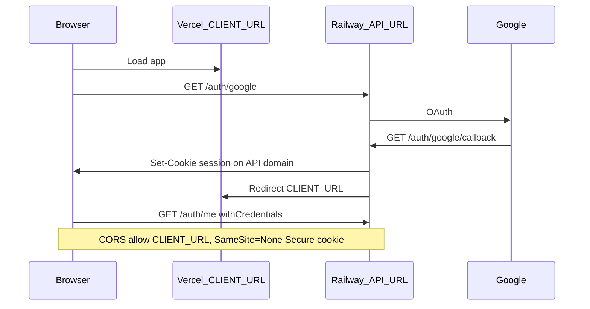

# Phase 9 — Polish & Deploy Implementation Plan

## Scope and constraints

- **Source of truth:** [PRD.md](PRD.md) §10 (UI/UX), §11 phase table; [cursor-prompts/PHASE_9_POLISH_DEPLOY.md](cursor-prompts/PHASE_9_POLISH_DEPLOY.md).
- **In scope:** CSS/UI polish, responsive layout, env audit, production deploy, root README.
- **Out of scope:** New features, changes to [gameLogicEngine.ts](server/src/services/gameLogicEngine.ts), new migrations, schema edits.
- **Commits:** One commit per task (1–10), per phase prompt.

## Current state vs Phase 9 tasks

| Task                 | Status   | Notes                                                                                                                                                                                            |
| -------------------- | -------- | ------------------------------------------------------------------------------------------------------------------------------------------------------------------------------------------------ |
| 1 XP bar animation   | Partial  | [XPBar.tsx](client/src/components/XPBar.tsx) uses `transition-all duration-500` on width directly; prompt requires `useEffect` + `width 600ms ease-out` so fill animates from **previous** value |
| 2 GULAG badge pulse  | Done     | [Dashboard.tsx](client/src/components/Dashboard.tsx) line 18: `GULAG: '... animate-pulse'`; `REDEMPTION` has no pulse (matches PRD)                                                              |
| 3 Wishlist glow      | Partial  | Affordable cards use `shadow-[0_0_16px_#4A90D940]` always; prompt wants `0 0 12px rgba(74,144,217,0.4)` base + `0.7` on hover                                                                    |
| 4 Toast animation    | Not done | [Toast.tsx](client/src/components/Toast.tsx) + [ToastContext.tsx](client/src/context/ToastContext.tsx) remove instantly on dismiss/timeout                                                       |
| 5 Empty states       | Partial  | Vault/quests/history use minimal one-line copy; prompt specifies exact strings + Vault “Add Item” CTA                                                                                            |
| 6 Responsive         | Not done | Nav is already a top bar ([App.tsx](client/src/App.tsx)); Vault is 2-col max (`sm:grid-cols-2`); Dashboard hero is side-by-side `flex` with no `md:` stacking                                    |
| 7 Env cleanup        | Partial  | [`.env.example`](.env.example) exists at **repo root** (not `server/.env.example`); `SKIP_AUTH` absent from code; `cookie.secure` tied to `NODE_ENV`; **OAuth/CORS still localhost-only**        |
| 8–10 Deploy / README | Not done | No root README; no `vercel.json`; passport callback + auth redirects hardcoded                                                                                                                   |

## Architecture — production auth flow

Cross-origin deploy (Vercel UI + Railway API) requires explicit cookie/CORS/OAuth URL config beyond what Phase 9 lists:



---

## Task 1 — XP bar animation

**File:** [client/src/components/XPBar.tsx](client/src/components/XPBar.tsx)

- Add `useState` for `displayWidth` (percent string or number).
- `useEffect` on `[currentXP, xpToNext]`:
  - Compute `targetPercent = Math.min((currentXP / xpToNext) * 100, 100)`.
  - On first mount, set immediately (no animation from 0 on load).
  - On subsequent changes, update `displayWidth` so CSS transitions from previous → new.
- Apply inline style: `width: ${displayWidth}%`, `transition: 'width 600ms ease-out'`.
- Remove conflicting `transition-all duration-500` class.
- Verify animation after quest complete and DevTools webhook (Dashboard refetch).

---

## Task 2 — State badge pulse

**Verify only** — no code change expected unless regression found.

- Confirm `user.state === 'GULAG'` uses `animate-pulse`; `ACTIVE` and `REDEMPTION` do not.

---

## Task 3 — Wishlist item glow

**File:** [client/src/components/WishlistItem.tsx](client/src/components/WishlistItem.tsx)

- On affordable (non-purchased) branch, replace static shadow with:
  - Default: `box-shadow: 0 0 12px rgba(74, 144, 217, 0.4)` (Tailwind arbitrary value or `@layer utilities` in [index.css](client/src/index.css)).
  - Hover: opacity `0.7` → `0 0 12px rgba(74, 144, 217, 0.7)`.
- Keep locked/unlocked styling unchanged.

---

## Task 4 — Toast animation

**Files:** [client/src/index.css](client/src/index.css), [client/src/components/Toast.tsx](client/src/components/Toast.tsx), [client/src/context/ToastContext.tsx](client/src/context/ToastContext.tsx)

**CSS keyframes in `index.css`:**

- `@keyframes toast-in`: `translateY(20px)` + `opacity: 0` → `translateY(0)` + `opacity: 1`, `200ms`.
- `@keyframes toast-out`: `opacity: 1` → `0`, `150ms`.

**Toast.tsx:**

- Apply `animate-toast-in` on mount.
- On dismiss (button or auto-timeout): add `animate-toast-out`, wait `150ms`, then call context removal.

**ToastContext:**

- Change `dismiss` to support delayed removal (e.g. `dismiss(id, { immediate?: boolean })`) or track `exitingIds` in context so Toast component can run exit animation before filter.

---

## Task 5 — Empty states

| Location                                                     | Exact copy (from prompt)                                                              | Action                                                                           |
| ------------------------------------------------------------ | ------------------------------------------------------------------------------------- | -------------------------------------------------------------------------------- |
| [Vault.tsx](client/src/pages/Vault.tsx)                      | “Your Vault is empty. Add items to start earning towards them.” + **Add Item** button | Replace `items.length === 0` paragraph; wire button to `setIsAddModalOpen(true)` |
| [Dashboard.tsx](client/src/pages/Dashboard.tsx)              | “No active quests. Your Loadout is empty.”                                            | Replace quests empty line; informational only (no CTA)                           |
| [SeasonHistory.tsx](client/src/components/SeasonHistory.tsx) | “No previous seasons. Complete your first month to see stats here.”                   | Replace current “No archived seasons yet.”                                       |

Optional polish: center empty blocks with consistent `py-12 text-center` styling (not required by prompt).

---

## Task 6 — Responsive layout

**Files:** [App.tsx](client/src/App.tsx), [Dashboard.tsx](client/src/pages/Dashboard.tsx), [Vault.tsx](client/src/pages/Vault.tsx)

Use Tailwind breakpoints only (`md:` = 768px, `lg:` = 1024px):

1. **Nav ([App.tsx](client/src/App.tsx))**
   - At `< md`: stack/wrap nav (title + links + logout), reduce padding (`px-4`), allow horizontal scroll or two-row flex — app already uses top nav, not sidebar; goal is usable at 768px, not a hamburger unless needed.
   - Hide or shorten “Finance Battle Pass” label on very narrow if overflow occurs.

2. **Vault grid ([Vault.tsx](client/src/pages/Vault.tsx))**
   - Change from `grid-cols-1 sm:grid-cols-2` to **`grid-cols-2 lg:grid-cols-3`** (3 cols ≥1024px, 2 cols below).

3. **Dashboard hero ([Dashboard.tsx](client/src/pages/Dashboard.tsx))**
   - Header row (`username` + tokens): `flex-col md:flex-row` + gap.
   - Hero inner row (level block + playable balance): `flex-col md:flex-row` + `text-right` → `md:text-right` on balance block.
   - Token chips: wrap with `flex-wrap`.

Manual check at **768px** and **1280px** (Task 10).

---

## Task 7 — Environment config cleanup

**No schema changes.** Backend production-readiness is required for Tasks 8–9.

### 7a — Audit and update env examples

**Files:** [`.env.example`](.env.example), [client/.env.example](client/.env.example)

| Variable                                    | Where used                                                               | Action                                                                                                            |
| ------------------------------------------- | ------------------------------------------------------------------------ | ----------------------------------------------------------------------------------------------------------------- |
| `DATABASE_URL`                              | [db/index.ts](server/src/db/index.ts)                                    | Document                                                                                                          |
| `PORT`                                      | [index.ts](server/src/index.ts)                                          | Document                                                                                                          |
| `GOOGLE_CLIENT_ID` / `GOOGLE_CLIENT_SECRET` | [passport.ts](server/src/config/passport.ts)                             | Document                                                                                                          |
| `SESSION_SECRET`                            | [index.ts](server/src/index.ts)                                          | Document                                                                                                          |
| `NODE_ENV`                                  | `cookie.secure`                                                          | Document as required in production                                                                                |
| **`CLIENT_URL`** (new)                      | CORS + OAuth redirects                                                   | Add to root `.env.example`, e.g. `http://localhost:5173`                                                          |
| **`API_URL`** (new, optional name)          | Passport `callbackURL`                                                   | Railway public URL, e.g. `https://<app>.up.railway.app` — or derive callback as `${API_URL}/auth/google/callback` |
| `VITE_API_URL`                              | [client.ts](client/src/api/client.ts), [auth.ts](client/src/api/auth.ts) | Keep in `client/.env.example`; production set in Vercel                                                           |

Note: Phase prompt references `server/.env.example`; repo convention is root [`.env.example`](.env.example) — update that file and add a one-line pointer in comments (“copy to `server/.env`”).

### 7b — Remove localhost hardcoding (deploy blockers)

| File                                         | Change                                                                                                        |
| -------------------------------------------- | ------------------------------------------------------------------------------------------------------------- |
| [passport.ts](server/src/config/passport.ts) | `callbackURL: \`${process.env.API_URL ?? 'http://localhost:3000'}/auth/google/callback\``                     |
| [auth.ts](server/src/routes/auth.ts)         | Redirect to `process.env.CLIENT_URL ?? 'http://localhost:5173'` on success/logout                             |
| [index.ts](server/src/index.ts)              | CORS: allow `CLIENT_URL` origin + localhost regex; `credentials: true`                                        |
| [index.ts](server/src/index.ts)              | Session cookie in production: `{ secure: true, sameSite: 'none' }`; dev: `{ secure: false, sameSite: 'lax' }` |
| [index.ts](server/src/index.ts)              | `app.set('trust proxy', 1)` when `NODE_ENV === 'production'` (Railway proxy)                                  |

### 7c — Verification checklist

- Grep: zero `SKIP_AUTH` in `server/src` and `client/src` (already clean; re-verify).
- Grep: no secrets in tracked files; `server/.env` and `client/.env` gitignored ([.gitignore](.gitignore)).
- `cookie.secure` only true when `NODE_ENV=production` (already present; extend with `sameSite` as above).

---

## Task 8 — Deploy backend to Railway

**Manual steps** (document in README); optional repo helper:

1. Create Railway project + PostgreSQL plugin → copy `DATABASE_URL`.
2. **Run migrations 001–007 in order** against Railway DB:
   ```bash
   for f in server/db/migrations/*.sql; do psql "$DATABASE_URL" -f "$f"; done
   ```
   (Or Railway SQL console, one file at a time.)
3. Set env vars: `DATABASE_URL`, `PORT`, `GOOGLE_*`, `SESSION_SECRET`, `NODE_ENV=production`, `CLIENT_URL=<vercel-url>`, `API_URL=<railway-public-url>`.
4. Google Cloud Console: authorized redirect URI = `https://<railway-domain>/auth/google/callback`.
5. Deploy from repo root: build `npm run build`, start `npm start` (existing [package.json](package.json)).
6. Verify: `GET https://<railway-domain>/health` → `{ "status": "ok" }`.

No new migration files in this phase.

---

## Task 9 — Deploy frontend to Vercel

1. Connect GitHub repo; set **Root Directory** = `client`.
2. Build: `npm run build`; Output: `dist`.
3. Env: `VITE_API_URL=https://<railway-public-url>` (no trailing slash).
4. Add [client/vercel.json](client/vercel.json) for SPA routing:
   ```json
   { "rewrites": [{ "source": "/(.*)", "destination": "/index.html" }] }
   ```
5. Deploy; test login, dashboard, vault, webhook → XP/Gulag loop on live URLs.

**Order:** Deploy Railway first (Task 8), then Vercel with final `VITE_API_URL` and `CLIENT_URL` on Railway pointing at Vercel URL.

---

## Task 10 — Final portfolio checks

Before sharing URL:

- [ ] Fresh Google login on production (clean session).
- [ ] [DevToolsPanel.tsx](client/src/components/DevToolsPanel.tsx) visible and working (portfolio feature).
- [ ] Run season reset once so Season History has ≥1 row.
- [ ] Browser console clean on `/`, `/vault`, `/onboarding`.
- [ ] Layout OK at 1280px and 768px.
- [ ] Create **[README.md](README.md)** at repo root:
  - What the app is (finance gamification / battle pass)
  - Tech stack (React, Vite, Tailwind, Express, PostgreSQL, Passport Google OAuth)
  - Local setup (`server/.env`, `client/.env`, migrations, `npm run dev` in server + client)
  - Link to live demo URL
  - Brief note on DevTools mock webhook for reviewers

---

## Exit criteria (phase complete)

- [ ] Public URL loads; OAuth works end-to-end on production
- [ ] Full loop on live: webhook → XP → Gulag → redemption → reset
- [ ] Animations, empty states, responsive layout per prompt
- [ ] Root README accurate with demo link
- [ ] No secrets in git history (audit before first public share)

## Risk notes

- **Cross-origin cookies** are the highest deploy risk; without `sameSite: 'none'` + CORS `CLIENT_URL`, login will appear to work locally but fail on Vercel/Railway.
- **Monorepo layout:** Vercel must use `client/` as root; Railway uses repo root `package.json`.
- **PRD accent:** Locked to `#4A90D9` in [tailwind.config.ts](client/tailwind.config.ts) — do not introduce `#00D4FF`.

## Suggested commit messages (one per task)

1. `polish: animate XP bar width on XP changes`
2. `polish: verify GULAG state badge pulse` (or skip if no diff)
3. `polish: wishlist affordable item glow on hover`
4. `polish: toast slide-in and fade-out animations`
5. `polish: empty states for vault, quests, and season history`
6. `polish: responsive layout for tablet widths`
7. `chore: production env vars, CORS, and OAuth URL config`
8. `docs: Railway deploy steps` (or chore if only env — deploy itself is manual)
9. `chore: Vercel SPA config and deploy notes`
10. `docs: add portfolio README with live demo link`
